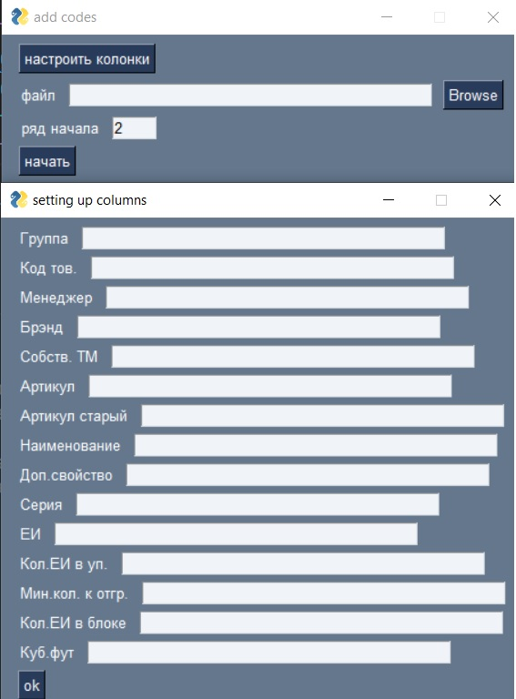

# Info

Each product is identified by code. Some products have several variations
(e.g. a ball in different colors) so to connect them articles are used.
Article is a string, in a such format: "mother_code/additional_info" (e.g. 12312/red or 12312/12321)

# About
This program adds children codes for every mother code in an excel file. Also some additional information could be provided (name, brand name, etc.). Information about
products is loaded from 'cat.pkl'.

